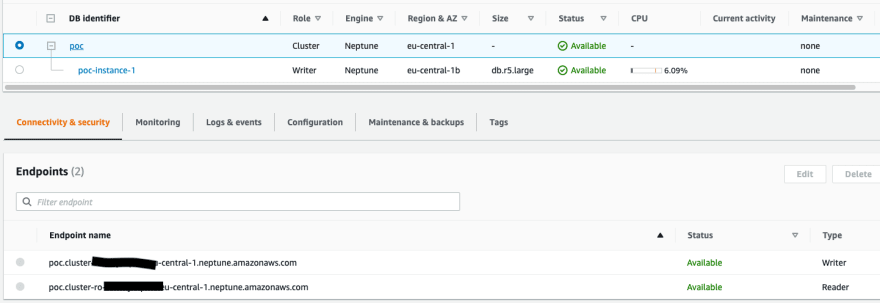

# AWS Neptune Notes

I had an opportunity to use AWS Neptune, a fully-managed graph database, for one of my projects. 
Here are my notes and experience on working with that.

## AWS Neptune

Amazon Neptune is a fully-managed graph database service that lets you query billions of relationships in milliseconds.  
It allows you to use the popular graph query languages Apache TinkerPop Gremlin and W3C’s SPARQL and openCypher to run powerful queries that are easy to write and perform well on connected data.


Neptune's main components are:
* Primary DB instance – Supports read and write operations and performs all data modifications to the cluster volume.
* Neptune replica – Connects to the same storage volume as the primary DB instance and supports only read operations (up to 15 Neptune Replicas).
* Cluster volume – Neptune data is stored in the cluster volume. A cluster volume consists of copies of the data across multiple Availability Zones in a single AWS Region.



### Cluster Endpoints

#### Cluster endpoints
A cluster endpoint connects to the current primary DB instance for that DB cluster. 
Each Neptune DB cluster has a cluster endpoint and one primary DB instance.

The cluster endpoint provides failover support for read/write connections to the DB cluster. Use the cluster endpoint for all write operations on the DB cluster, including inserts, updates, deletes, and data definition language (DDL) changes. You can also use the cluster endpoint for read operations, such as queries.


The following example illustrates a cluster endpoint for a Neptune DB cluster.
```
mydbcluster.cluster-123456789012.us-east-1.neptune.amazonaws.com:8182
```

#### Reader endpoint
A reader endpoint connects to one of the available Neptune replicas for that DB cluster. Each Neptune DB cluster has a reader endpoint. If there is more than one Neptune replica, the reader endpoint directs each connection request to one of the Neptune replicas.

You can't use the reader endpoint for write operations unless you have a single-instance cluster (a cluster with no read-replicas). In that case and that case only, the reader can be used for write operations as well as read operations.


### Network Isolation

Just like RDS, ***Neptune runs in Amazon VPC***, which means, 
* You need to create/select a VPC before launching the Neptune cluster 
* After the DB  is created, you can't change the VPC
* Any lambdas you create for interacting with the DB, need to have access to the VPC ie.
  * you will create a security group for your Lambda functions to use within your VPC. **This SG must have access to port 8192 to access Neptune DB**
  * Because Lambda automatically scales based on the number of events that is needs to process, your VPC must have an adequate supply of free IP addresses on the designated subnets.
  * As soon as you enable this functionality for a particular function, the function no longer has access to the Internet by default
  

### User Interface to View Table
**None!** Unlike DynamoDB, or Aurora Serverless RDS, there is no built-in user interface.

Instead, on top of your Neptune cost, Amazon asks you to use a Jupyter notebook using the Neptune workbench. Of course, you get billed for workbench resources through Amazon SageMaker, separately from your Neptune billing. 

Following the steps as described [here](https://docs.aws.amazon.com/neptune/latest/userguide/graph-notebooks.html), you can visualize your graph.

### Neptune Graph Data Model

In a graph database, we have the following entities
* Node/Vertex: represents an item in the graph.
* Edge/Relation: a connection between two nodes.

Each Node, or edge can have a 
* Label 
* Properties: key, value pairs

Consider the following Gremlin Statements

| Statement | Description|
|---|---|
| g.addV("Person").property(id, "v1") | Adds a vertex with label "Person" and property, id=1 | 
| g.addE("knows").from(V("v1")).to(V("v2")).property(id, "e1") | Adds an edge labelled knows from v1 to v2 vertex which has property id=e1|
| g.V("v1").property("name", "John") | Sets a name for the previously created vertex with id=v1|

Now we can traverse the graph DB using statements like

| Statement | Description|
|---|---|
| g.V("v1").label() | the labels of vertex v1 | 
| g.V("v1").out("knows") |  the 'knows' **out-edges** of vertex v1|
| g.V().hasLabel("Person") | vertices which have a Person vertex label|
| g.E("e1").bothV() | What are the from/to vertices of a given edge e1|
|  g.V("v1").in() |  incoming adjacent vertices v1 |

More gremlin recipes here https://tinkerpop.apache.org/docs/current/recipes/

Some more features of Neptune are as follows
* Global database spanning multiple regions (how this works with VPC?)
* Neptune Bulk Loader for importing data from S3
* Export data to S3
* Streams: capture changes to a graph as they occur.
* Full-text search: based on Amazon OpenSearch Service and Lucene query syntax.

I could not experiment with any of the above, due to project limitations, but reading the AWS documentation made me feel this is one of the 10% projects.   
If this was in the Google Cloud ecosystem, I would be worried about using it for any of my project, due to Google's infamous record of shutting down projects (remember Google Wave? :()  

With AWS however the story is different, and I found it stable enough for the queries I was using it for. However, the project I used it on was a POC only, so didn't really push the limits of data here.  


## AWS Neptune Serverless
On Oct 26 2022, AWS [announced the availability of AWS Neptune Serverless](https://aws.amazon.com/about-aws/whats-new/2022/10/amazon-neptune-serverless-generally-available/)

However, I feel **serverless** term here is misused by AWS, as serverless (for me) means scale to zero if not used, while what AWS is providing here is simply Auto-Scaling.  
And remember you still have to use this behind a VPC
